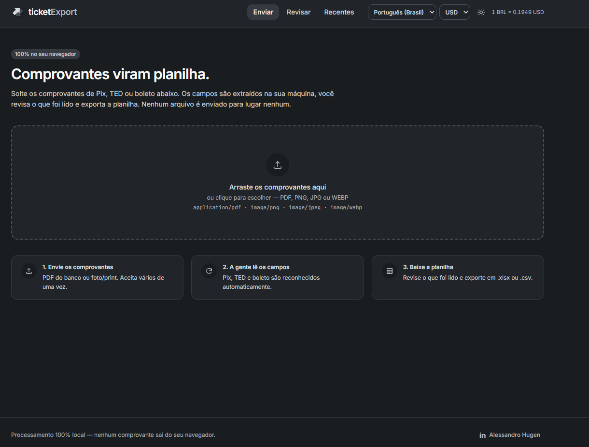

<h1 align="center">ticketExport</h1>

<p align="center">
  Comprovantes de Pix, TED e boleto viram planilha — sem que nenhum arquivo saia do seu navegador.
</p>

<p align="center">
  
</p>

---

## O problema

Fechar o mês com comprovantes significa abrir um por um, copiar valor, data,
CNPJ e identificador, e colar tudo numa planilha. É trabalho mecânico, demorado
e fácil de errar — e mandar comprovante bancário para um site qualquer para
automatizar isso não é uma opção razoável.

O ticketExport faz essa transcrição dentro do próprio navegador. O PDF é lido
pelo pdf.js, a imagem passa por OCR em WebAssembly e a planilha é montada em
memória — **nenhum byte do comprovante sai da máquina.**

As requisições que o app faz são todas de mão única, para buscar código e
recursos: a fonte no Google Fonts, o modelo de idioma e o núcleo WebAssembly do
tesseract no jsDelivr (na primeira vez que você usa OCR) e a cotação do dólar
numa API pública (só quando você troca a moeda). Nenhuma delas carrega dado seu.

## O que ele faz

- Lê **PDF do banco, foto e print** de comprovante de Pix, TED e boleto
- Lê **extrato de conta corrente**, virando uma linha por lançamento — um PDF
  com 150 Pix recebidos vira 150 linhas de uma vez
- Extrai 14 campos: tipo, data, hora, valor, pagador e recebedor (nome, CPF/CNPJ
  e banco), identificador, vencimento e descrição
- Mostra tudo numa **tabela editável** antes de exportar, com o comprovante
  original ao lado para conferência
- Exporta **.xlsx** (com data, moeda e largura de coluna de verdade) ou **.csv**
- Guarda as **3 últimas planilhas** para baixar de novo
- **3 idiomas** (pt-BR, English, Español), **2 moedas** (BRL, USD com conversão
  real) e tema claro/escuro — tudo salvo no navegador

## Rodando

```bash
npm install
npm run dev
```

Requer Node 20.19+ ou 22.12+ (exigência do Vite 8). Não há backend, banco,
nem variável de ambiente.

```bash
npm run build      # build de produção
npm run format     # prettier
```

## Como funciona

```
arquivo → extração de texto → parser → revisão do usuário → planilha
```

Um arquivo gera **uma ou mais linhas**: um comprovante vira uma, um extrato vira
uma por lançamento.

| Entrada                 | Caminho                                                    |
| ----------------------- | ---------------------------------------------------------- |
| PDF com camada de texto | `pdfjs-dist` lê o texto direto — rápido e exato            |
| PDF digitalizado        | `pdfjs-dist` rasteriza as páginas → `tesseract.js` faz OCR |
| Imagem (PNG/JPG/WEBP)   | `tesseract.js` faz OCR com reconstrução de layout          |

A escolha entre os dois caminhos é automática, por densidade de caracteres por
página: abaixo de 40, o PDF é tratado como digitalizado.

### Reconstrução de layout no OCR

Comprovante de app é uma tabela de duas colunas. Quando a coluna do rótulo é
estreita, ele quebra em duas linhas — e o texto plano do OCR embaralha o
resultado:

```
Favoreci  CENTRO DE EDUCACAO INFANTIL
do                                 CI
```

Por isso o OCR é pedido com `{ blocks: true }` e as coordenadas de cada palavra
são usadas para remontar as linhas
([`layout.js`](src/infrastructure/extraction/layout.js)):

1. Palavras viram linhas por sobreposição vertical.
2. Dentro da linha, o **maior vão horizontal** separa rótulo de valor — vãos
   entre palavras ficam em ~20 px, entre colunas passam de 120 px.
3. Linha cujo rótulo começa em minúscula é continuação da anterior. Fragmento de
   até 4 caracteres cola sem espaço (`Favoreci` + `do`); maior que isso entra
   como palavra nova (`Nome do` + `recebedor`).

```
Favorecido CENTRO DE EDUCACAO INFANTIL CI
```

É a mesma correção resolvida por geometria, em vez de um remendo por banco.

### Extrato de conta corrente

Extrato não é comprovante: é uma lista. O
[parser do extrato do BB](src/domain/receipt/statements/bbStatement.js) lê o
par de linhas que o banco usa para cada lançamento —

```
14/08/2026 0000 14397 821 Pix - Recebido 141.005.015.953.521 1.920,00 C
14/08 10:05 47687426000129 NEXSTILL SO
```

— e resolve três coisas que o formato impõe:

- **O indicador `C`/`D` decide quem é quem.** Crédito: a contraparte é a
  pagadora e o titular da conta é o recebedor. Débito: o inverso.
- **CPF vem preenchido com zeros à esquerda** até 14 dígitos
  (`00029220719878` → `292.207.198-78`), do mesmo tamanho de um CNPJ.
- **A quebra de página separa o lançamento do seu detalhe**, com cabeçalho e
  rodapé do navegador no meio. A busca pelo detalhe pula linhas que não são nem
  detalhe nem um novo lançamento.

Linhas de saldo são descartadas, e o nome da contraparte é ignorado quando o
banco repete o CNPJ no lugar dele.

### Um extrator, um vocabulário

Não há um parser por banco. Há **um extrator** dirigido por um vocabulário único
([`vocabulary.js`](src/domain/receipt/parsing/vocabulary.js)) que mapeia cada
conceito — pagador, recebedor, valor, vencimento — aos seus sinônimos. O tipo do
comprovante (Pix, TED, boleto) é **resultado de classificação**, não seletor de
código: sai do mesmo vocabulário.

Isso significa que ensinar um banco novo é acrescentar sinônimo em um lugar, e o
sinônimo passa a valer para todos os tipos de comprovante de uma vez.

Seções de partes aceitam duas formas de sinônimo. Os descritivos (`quem pagou`,
`conta de origem`) casam mesmo com valor na mesma linha. Os curtos e ambíguos
(`de`, `para`, usados pelo Itaú) só valem quando a linha **é exatamente** aquela
palavra — sem essa distinção, `de` casaria com meio documento.

### Motor de rótulos

A extração casa rótulos ancorados no início da linha
([`labels.js`](src/domain/receipt/parsing/labels.js)). Três regras que não são
óbvias até quebrarem:

- **Fronteira de palavra obrigatória.** O rótulo `banco` não pode casar dentro de
  "UNI**BANCO** S.A." — sem isso, o banco do pagador virava `S.A`.
- **Rótulo truncado só vale se o corte for no meio de uma palavra.** `Favoreci`
  é um truncamento legítimo de `Favorecido`; `data de` **não** é truncamento de
  `data de vencimento`, senão "Data de pagamento" vira vencimento.
- **Rodapé é separado do corpo.** O bloco final traz o CNPJ da instituição
  (Nu Pagamentos, 18.236.120/0001-58), que era capturado como CNPJ do pagador.
  O rodapé fica isolado e só é consultado como último recurso, para o ID da
  transação.

Dado faltando é melhor que dado errado: quando a seção do pagador ou do
recebedor não é encontrada, os campos ficam vazios em vez de receberem um chute.
Existe uma tela de revisão justamente para isso.

### Conferência cruzada do boleto

Quando o comprovante traz linha digitável ou código de barras,
[`boletos-desc-br`](https://www.npmjs.com/package/boletos-desc-br) decodifica o
valor e o vencimento embutidos no próprio código e o app compara com o valor
lido do texto. Divergiu, o comprovante ganha um aviso — é assim que ele detecta
sozinho quando o OCR erra um dígito.

A validação de dígito verificador da biblioteca é parcial, então o código
decodificado **nunca** sobrescreve o que está escrito no comprovante: ele só
confirma, preenche lacuna ou alerta.

## Arquitetura

```
src/
├── domain/            regras de negócio puras (JS, sem Vue, sem libs de UI)
│   ├── shared/        dinheiro, data, CPF/CNPJ, texto, moeda
│   └── receipt/       entidade, campos, extrator e parsers de extrato
├── application/       casos de uso e portas (contratos)
│   ├── ports/         interfaces que a infraestrutura implementa
│   └── use-cases/     extrair comprovante, exportar planilha
├── infrastructure/    adaptadores: pdf.js, tesseract, xlsx, csv, câmbio, storage
├── presentation/      Vue: design system, views, stores, composables
├── i18n/              um arquivo JSON por idioma
└── container.js       composition root — onde tudo é ligado
```

A regra de dependência é única: **as setas apontam para dentro.**
`presentation → application → domain`, e `infrastructure → application`.
O domínio não conhece ninguém.

Na prática isso significa que o domínio roda no Node puro, sem bundler e sem
browser — os parsers foram desenvolvidos e testados assim, rodando direto contra
o texto de comprovantes reais.

## Pontos de extensão

| Quero adicionar                  | O que fazer                                                                                                               | O que mais muda                                                                                 |
| -------------------------------- | ------------------------------------------------------------------------------------------------------------------------- | ----------------------------------------------------------------------------------------------- |
| **Idioma**                       | Criar `src/i18n/locales/<código>.json`                                                                                    | Nada — `import.meta.glob` registra, e o nome do seletor vem do `_meta.label` do próprio arquivo |
| **Moeda**                        | Uma entrada em `CURRENCIES` ([`currency.js`](src/domain/shared/currency.js))                                              | Nada — a cotação vem na mesma chamada da API e o `Intl` formata                                 |
| **Banco/formato de comprovante** | Acrescentar os sinônimos dele em `vocabulary.js`                                                                          | Nada — vale para todos os tipos                                                                 |
| **Formato de extrato**           | Criar `src/domain/receipt/statements/<nome>.js` com `{ id, score(text), parse(lines) }` e registrar no array `STATEMENTS` | Nada                                                                                            |
| **Coluna na planilha**           | Uma entrada em `RECEIPT_FIELDS` + a chave em `fields` nos 3 idiomas                                                       | Nada — aparece na tabela, no `.xlsx` e no `.csv`                                                |

Detectar um formato novo é pontuação, não `if`: cada parser dá uma nota ao texto
e o registry usa o vencedor, caindo num parser genérico se ninguém pontuar.

## Design system

A paleta é a escala neutra `ink-50` … `ink-800`
([coolors.co](https://coolors.co/palette/f8f9fa-e9ecef-dee2e6-ced4da-adb5bd-6c757d-495057-343a40-212529)),
mais três cores funcionais dessaturadas para sucesso, alerta e erro — cinza puro
não comunica estado.

Texto nunca referencia a escala direto. Os quatro tokens semânticos ficam em
[`main.css`](src/assets/styles/main.css):

| Token         | Tema claro | Contraste sobre a superfície |
| ------------- | ---------- | ---------------------------- |
| `text-title`  | `ink-800`  | 14,6:1                       |
| `text-body`   | `ink-700`  | 10,9:1                       |
| `text-muted`  | `ink-600`  | 7,8:1                        |
| `text-subtle` | `ink-500`  | 4,5:1                        |

No tema escuro a escala `ink` é invertida, então os quatro tokens acompanham sem
nenhuma variante `dark:` espalhada pelos componentes.

## Stack

|                                     |                                                    |
| ----------------------------------- | -------------------------------------------------- |
| Vue 3 + Vite                        | `<script setup>`, code splitting por rota          |
| Pinia + Vue Router                  | estado compartilhado e navegação                   |
| Tailwind CSS v4                     | tema em CSS via `@theme`, sem `tailwind.config.js` |
| pdfjs-dist                          | leitura de PDF e rasterização                      |
| tesseract.js                        | OCR em WebAssembly, em Web Worker                  |
| write-excel-file                    | geração de `.xlsx`                                 |
| vue-i18n, vue-currency-input        | idioma e máscara de moeda                          |
| boletos-desc-br, cpf-cnpj-validator | validação de boleto e de documento                 |

O carregamento inicial é ~46 kB gzip. pdf.js (129 kB), tesseract e o gerador de
planilha só são baixados quando alguém envia um arquivo ou exporta.

### Por que essas bibliotecas

- **`write-excel-file` no lugar do SheetJS.** O pacote `xlsx` no npm está parado
  na 0.18.5 desde 2023 e acumula CVEs; a versão mantida só sai por tarball do
  CDN da SheetJS. O `exceljs` está inativo e desempacota 21 MB.
- **`boletos-desc-br` no lugar de `@mrmgomes/boleto-utils`.** O segundo é mais
  completo, mas arrasta `moment-timezone` (~200 kB). O primeiro tem zero
  dependências e 32 kB.
- **CSV escrito à mão.** Separador `;` e BOM UTF-8, que é o que o Excel em
  português espera. Uma dependência aqui não se pagaria.

## Decisões técnicas

- **Datas no `.xlsx` em UTC.** O Excel guarda data como número de dias desde
  1899-12-30, calculado sobre o epoch UTC. Usar meia-noite local deslocaria a
  data em um dia para quem está em fuso positivo.
- **O valor é sempre guardado em reais.** A moeda escolhida afeta exibição,
  edição e exportação, nunca o dado. Editar em dólar converte de volta na hora
  de gravar, e a célula ignora o `setValue` programático para o valor não
  oscilar um centavo a cada troca.
- **Dados extraídos em caixa alta.** Comprovante bancário vem em maiúsculas e
  planilha contábil espera maiúsculas. Normalizar eliminou toda a lógica de
  capitalização (partículas, siglas, hífens) que existia antes.
- **Rótulos de campo fora do domínio.** `RECEIPT_FIELDS` guarda só `key`, `kind`
  e `width`. O texto vem do i18n e é passado para os escritores de planilha, que
  continuam sem saber que existe tradução.
- **Layout do OCR na infraestrutura, não no domínio.** Reconstruir texto a partir
  de caixas delimitadoras é detalhe do tesseract. O domínio continua recebendo
  texto e devolvendo comprovante.
- **Histórico guarda dados, não arquivos.** O `localStorage` armazena as linhas
  das 3 últimas exportações e a planilha é regerada na hora do download — o que
  de quebra permite baixar em CSV algo exportado em XLSX. Blob em base64
  estouraria a cota de 5 MB em poucas exportações.
- **`cpf-cnpj-validator` só filtra achados sem rótulo.** Um CPF/CNPJ logo após o
  rótulo `CPF:` é mantido mesmo se o dígito verificador falhar, porque o OCR pode
  ter trocado um número e o usuário corrige na revisão. Já um número solto de 11
  ou 14 dígitos só entra se for válido.

## Limitações conhecidas

- OCR de foto erra dígitos. Identificadores longos (código de barras, ID de
  transação) são os mais afetados — por isso existe a conferência cruzada e a
  tela de revisão.
- Os parsers foram calibrados em comprovantes de Nubank, InfinitePay, Banco do
  Brasil e Itaú, e no extrato de conta corrente do Banco do Brasil.
  Outros layouts caem no parser genérico, que acerta valor, data e hora mas
  costuma deixar as partes envolvidas em branco.
- A cotação vem de uma API pública sem chave, com cache de 6 horas. Se ela cair,
  os valores continuam em reais e a interface avisa.
- O primeiro OCR baixa ~2 MB de modelo de idioma do CDN. Depois disso o
  navegador reaproveita do cache, mas a primeira leitura de imagem exige rede.
- Não há testes automatizados. A verificação foi feita rodando os parsers no
  Node contra comprovantes reais e inspecionando o XML do `.xlsx` gerado.

## Autor

[Alessandro Hugen](https://www.linkedin.com/in/alehugen)
